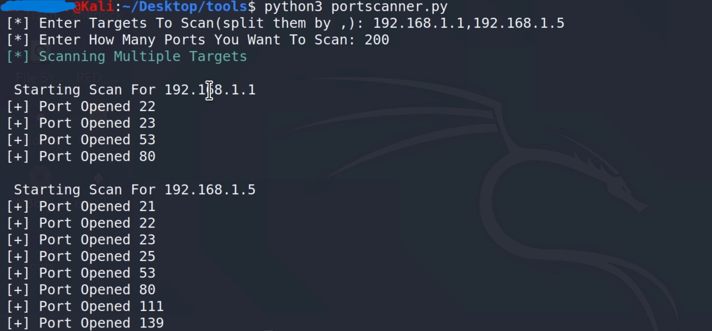

# Vulnerable Port Scanner

A powerful Python tool designed to help security professionals and ethical hackers **scan for open vulnerable ports** on target systems. This tool aids in identifying potential weaknesses in network security by detecting open ports that might be exploitable.

## 📘 Introduction
The **Vulnerable Port Scanner** is a Python-based tool that scans a target IP address for commonly exploited open ports. By identifying open ports, security professionals can prioritize and mitigate potential vulnerabilities, thereby enhancing network security.

**Use responsibly** and only on systems you have explicit permission to test.

## ✨ Features
- **Comprehensive Port Scanning**: Scans for a range of known vulnerable ports.
- **Customizable Port Range**: Option to define specific ports or ranges to scan.
- **Fast and Efficient**: Optimized scanning process to quickly identify open ports.
- **User-Friendly**: Command-line interface that is simple to configure and run.

## 🚀 Installation
To use the Vulnerable Port Scanner, clone the repository and install the required dependencies.

1. Clone the repository and navigate to the project folder.
2. Install dependencies using the `requirements.txt` file.

## 🛠️ Usage
```bash
cd portscanner
python3 portscanner.py
```

### Vulnerable Port Scanner
To scan a target IP address, run the script with the following parameters:

- **Target IP**: Specify the IP address of the system to scan.
- **Port Range** (optional): Define a specific range of ports or individual ports to scan.

The tool will attempt to connect to each specified port on the target IP, reporting which ports are open.

## 📊 Example Output
Here’s an example of the tool’s output:



